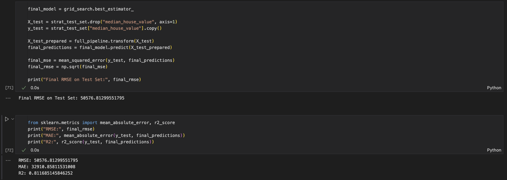
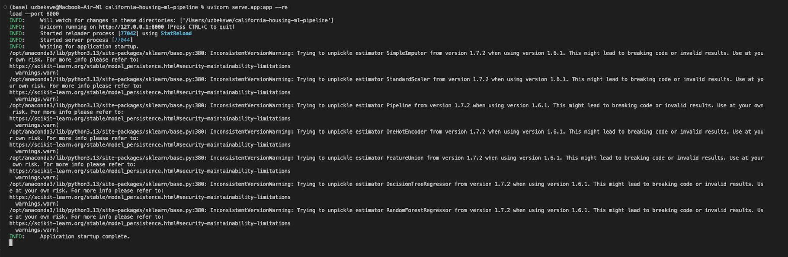
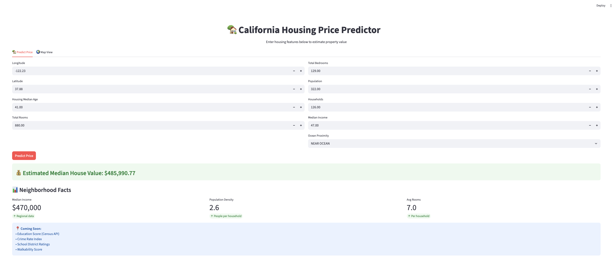
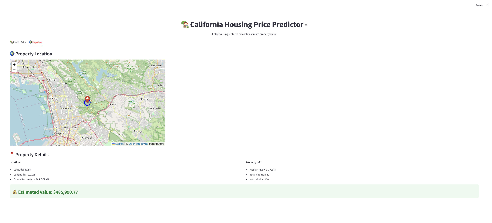

# 🏡 California Housing Price Prediction (End-to-End ML System)

## 📌 Overview
Full production-style ML project:
- Data cleaning & feature engineering
- Pipeline + GridSearchCV tuning
- Model persistence (joblib)
- FastAPI inference service
- Streamlit UI calling FastAPI
- Dockerized microservices
- Interactive map visualization
- Ready for cloud deployment

## 🧠 Model
Algorithm: RandomForestRegressor  
Features: 8 numerical + 1 categorical + engineered ratios  
Metrics (test set):
- RMSE: ~50k
- MAE: ~35k
- R²: ~0.8

## 🧱 Architecture

```
Notebook → Saved Pipeline → FastAPI → Streamlit UI → User
```

## 🚀 Run Locally

### 1) FastAPI backend

```bash
uvicorn serve.app:app --reload --port 8000
```

### 2) Streamlit UI

```bash
streamlit run app/streamlit_app.py
```

### 3) Docker (full stack)

```bash
docker-compose up --build
```

## 🌍 Features
| Feature | Status |
|---|---|
| End-to-end ML pipeline | ✅ |
| FastAPI inference | ✅ |
| Streamlit UI | ✅ |
| Interactive map | ✅ |
| Docker microservices | ✅ |
| Cloud deploy ready | ✅ |

## 🖼 Screenshots

### Notebook Training Results


### FastAPI Running


### Streamlit UI - Prediction


### Streamlit UI - Interactive Map


## 📦 Tech Stack
- Python, Pandas, NumPy
- Scikit-learn
- FastAPI + Uvicorn
- Streamlit
- Docker / Compose
- Folium map

## 👨‍💻 Author
Mukhammadali — AI/ML Engineer.
