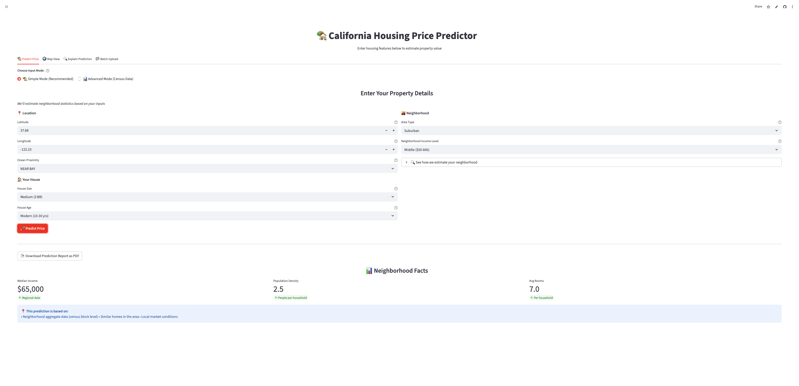
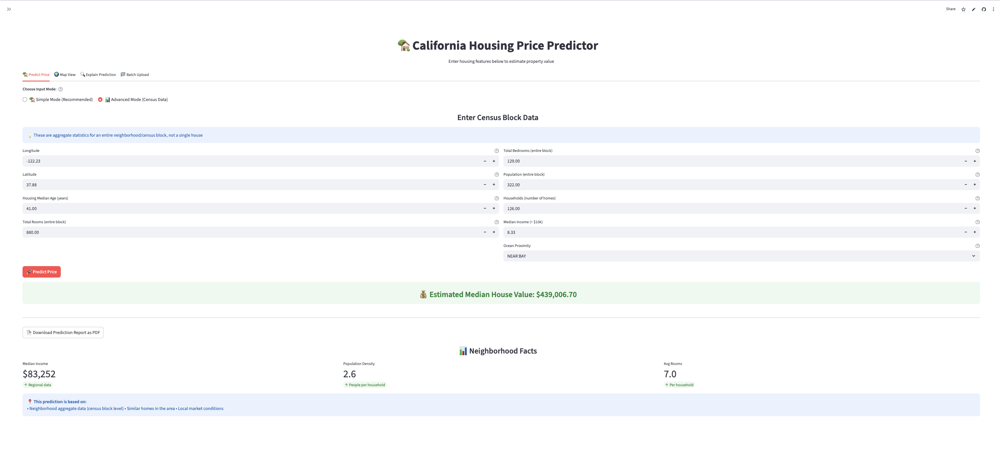
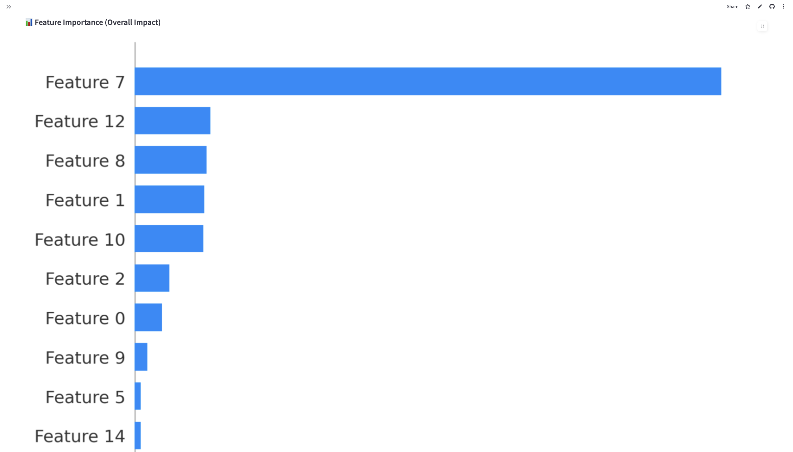
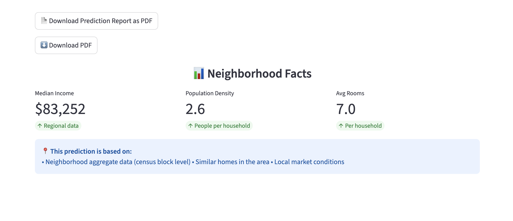
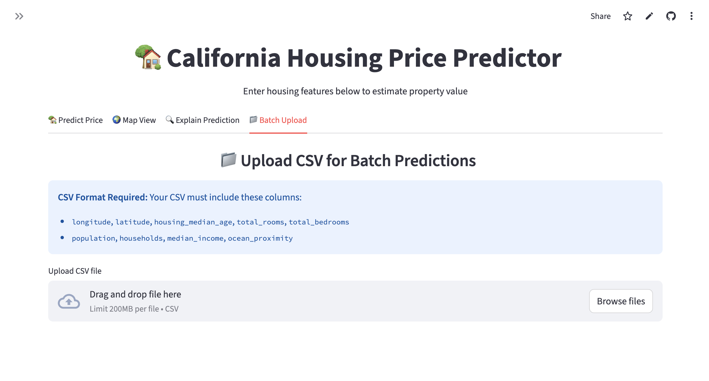

# 🏡 California Housing Price Prediction (End-to-End ML System)

## 📌 Overview
Full production-style ML project with dual-mode user interface for both homebuyers and data scientists:
- **Dual Input Modes**: Simple mode for homebuyers, Advanced mode for census data
- Data cleaning & feature engineering with automated pipelines
- Pipeline + GridSearchCV hyperparameter tuning
- Model persistence (joblib) with versioning
- FastAPI inference service with RESTful endpoints
- Streamlit UI with interactive visualizations
- Explainable AI with SHAP analysis
- PDF report generation for predictions
- Batch processing via CSV upload
- Dockerized microservices architecture
- Interactive map visualization (Street & Satellite views)
- Ready for cloud deployment (Streamlit Cloud compatible)

## 🧠 Model Performance
**Algorithm**: RandomForestRegressor with GridSearchCV  
**Features**: 8 numerical + 1 categorical + engineered ratios (rooms_per_household, bedrooms_per_room, population_per_household)  
**Metrics** (test set):
- **RMSE**: ~$50,000
- **MAE**: ~$35,000
- **R² Score**: ~0.81

## 🧱 Architecture

```
Notebook → Saved Pipeline → FastAPI → Streamlit UI → User
```

## 🚀 Quick Start Guide

### Option 1: Use the Live App (Recommended)
Visit the deployed application on Streamlit Cloud:
```
https://your-app-url.streamlit.app
```

**Steps:**
1. Select **🏡 Simple Mode** (recommended for most users)
2. Enter property details (house size, area type, income level, etc.)
3. Click **Predict Price** to get instant valuation
4. Explore the **Map View** to see property location
5. Download a **PDF Report** with all details

### Option 2: Run Locally

#### 1) FastAPI Backend
```bash
cd california-housing-ml-pipeline
uvicorn serve.app:app --reload --port 8000
```
Access API docs at `http://localhost:8000/docs`

#### 2) Streamlit UI
```bash
streamlit run app/streamlit_app.py
```
Access UI at `http://localhost:8501`

#### 3) Docker (Full Stack)
```bash
docker-compose up --build
```
- FastAPI: `http://localhost:8000`
- Streamlit: `http://localhost:8501`

## 📊 Using the App

### Simple Mode (For Homebuyers)
Perfect if you're looking to predict a specific house price:
- **House Size**: Small, Medium, Large, Very Large
- **Area Type**: Urban, Suburban, Rural
- **Income Level**: Low, Medium, High
- **House Age**: New, Moderate, Old
- **Ocean Proximity**: Inland, Near Ocean, Near Bay, Island

The app automatically converts these to census block data using intelligent presets.

### Advanced Mode (For Data Scientists)
Enter census block data directly:
- Median Income
- Housing Median Age
- Total Rooms
- Total Bedrooms
- Population
- Households
- Ocean Proximity

Perfect for analyzing neighborhood-level predictions or working with census datasets.

### Batch Processing
Upload a CSV file with multiple properties:
1. Go to **TAB 4: Batch Upload**
2. Upload CSV with required columns
3. Download results with predictions for all properties

## 🌍 Features

### 🏠 User Interface
| Feature | Description | Status |
|---------|-------------|--------|
| **🏡 Simple Mode** | User-friendly inputs (house size, area type, income level) with automatic conversion to census data | ✅ |
| **📊 Advanced Mode** | Direct census block data entry for power users and data scientists | ✅ |
| **🔄 Transparent Conversion** | Expandable section showing how user inputs map to model features | ✅ |

### 🗺️ Visualization & Analysis
| Feature | Description | Status |
|---------|-------------|--------|
| **Interactive Map** | Folium-based map with property location markers | ✅ |
| **Satellite View** | Toggle between street and satellite imagery | ✅ |
| **Neighborhood Stats** | Display median income, population, and housing age for surrounding area | ✅ |
| **SHAP Analysis** | Explainable AI showing feature contributions to predictions | ✅ |

### 📄 Output & Export
| Feature | Description | Status |
|---------|-------------|--------|
| **PDF Reports** | Professional prediction reports with property details and map | ✅ |
| **Batch Processing** | CSV upload for multiple property predictions | ✅ |
| **Bulk Export** | Download batch results as CSV with all predictions | ✅ |

### 🏗️ Technical Features
| Feature | Description | Status |
|---------|-------------|--------|
| **End-to-end ML Pipeline** | From raw data to production model with automated preprocessing | ✅ |
| **FastAPI Backend** | RESTful API for model inference with automatic documentation | ✅ |
| **Docker Microservices** | Containerized architecture for easy deployment | ✅ |
| **Cloud Ready** | Deployed on Streamlit Cloud with GitHub integration | ✅ |

## 🖼 Screenshots

### Streamlit UI - Simple Mode (User-Friendly)

*Easy-to-use interface for homebuyers with dropdown selections*

### Streamlit UI - Advanced Mode (Census Data)

*Direct census data entry for data scientists and power users*

### Interactive Map Visualization

*Folium map with property markers, satellite view toggle, and neighborhood stats*

### SHAP Analysis (Explainable AI)

*Feature contribution analysis showing which factors influenced the prediction*

### PDF Report Generation

*Professional prediction reports with all property details*

### Batch Processing (CSV Upload)

*Upload multiple properties and get predictions for all of them*

### FastAPI Backend Documentation

*FastAPI automatic documentation with interactive API testing*

### Notebook Training Results

*Jupyter notebook showing the complete ML pipeline and model training*

## 📦 Tech Stack

### Machine Learning & Data Science
- **Python 3.10+**: Core programming language
- **Pandas & NumPy**: Data manipulation and numerical computing
- **Scikit-learn**: ML pipeline, RandomForestRegressor, GridSearchCV
- **SHAP**: Explainable AI and feature importance analysis

### Backend & API
- **FastAPI**: Modern, high-performance web framework
- **Uvicorn**: ASGI server for FastAPI
- **Joblib**: Model serialization and persistence

### Frontend & Visualization
- **Streamlit**: Interactive web application framework
- **Folium**: Interactive map visualizations
- **Plotly**: SHAP waterfall charts
- **ReportLab**: PDF generation for prediction reports

### DevOps & Deployment
- **Docker & Docker Compose**: Containerization and orchestration
- **Streamlit Cloud**: Cloud deployment platform
- **GitHub Actions**: CI/CD (optional)

## 🎯 Project Structure
```
california-housing-ml-pipeline/
├── notebooks/
│   └── california_housing_end_to_end.ipynb  # Training notebook
├── app/
│   └── streamlit_app.py                      # Streamlit UI (dual-mode)
├── serve/
│   └── app.py                                # FastAPI backend
├── data/
│   └── housing.csv                           # California housing dataset
├── saved_models/
│   ├── housing_pipeline.pkl                  # Trained pipeline
│   └── scaler.pkl                            # Feature scaler
├── docker-compose.yml                        # Docker orchestration
├── requirements.txt                          # Python dependencies
└── README.md                                 # This file
```

---

## 🚢 Deployment

### Streamlit Cloud (Recommended)
1. Fork this repository
2. Connect to Streamlit Cloud
3. Deploy from `main` branch
4. Set `app/streamlit_app.py` as the main file

### Docker Deployment
```bash
# Build and run with docker-compose
docker-compose up -d

# Or build individual services
docker build -t housing-api -f Dockerfile.api .
docker build -t housing-ui -f Dockerfile.ui .
```

### Manual Deployment (Linux Server)
```bash
# Install dependencies
pip install -r requirements.txt

# Run FastAPI backend
uvicorn serve.app:app --host 0.0.0.0 --port 8000 &

# Run Streamlit frontend
streamlit run app/streamlit_app.py --server.port 8501 --server.address 0.0.0.0
```

## 🔮 Future Enhancements
- [ ] Add user authentication and saved predictions
- [ ] Integrate real-time housing market data
- [ ] Support for other California regions
- [ ] Mobile-responsive UI improvements
- [ ] A/B testing for different model versions
- [ ] Integration with real estate APIs (Zillow, Redfin)

## � License
This project is open-source and available under the MIT License.

## �👨‍💻 Author
**Mukhammadali** — AI/ML Engineer

Building production-ready ML systems with a focus on user experience and explainability.

---

### 🌟 Star this repo if you found it helpful!
